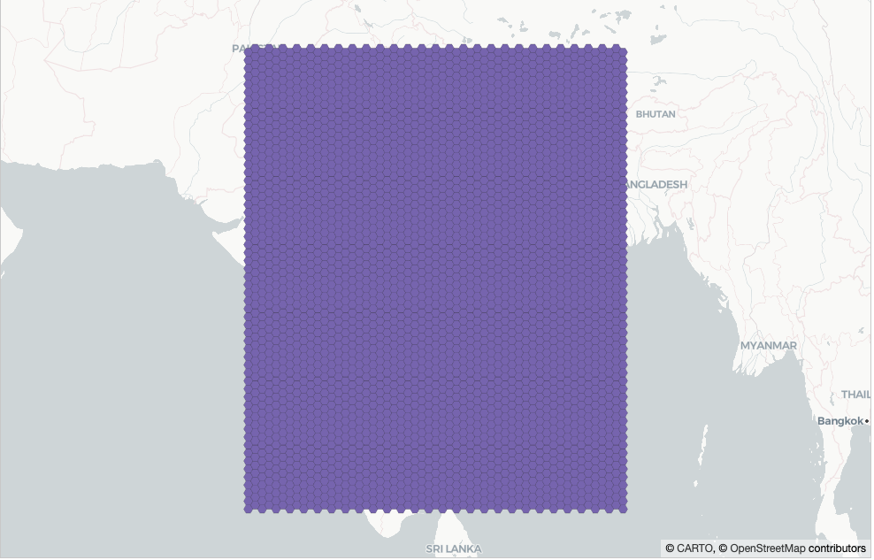
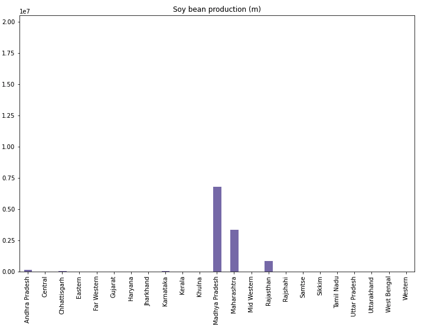
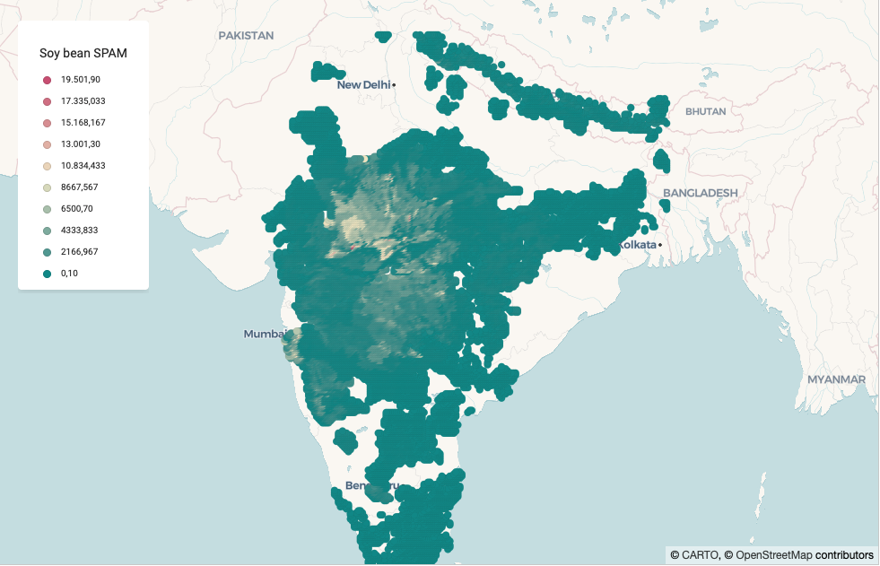
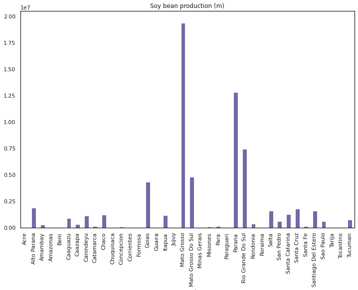
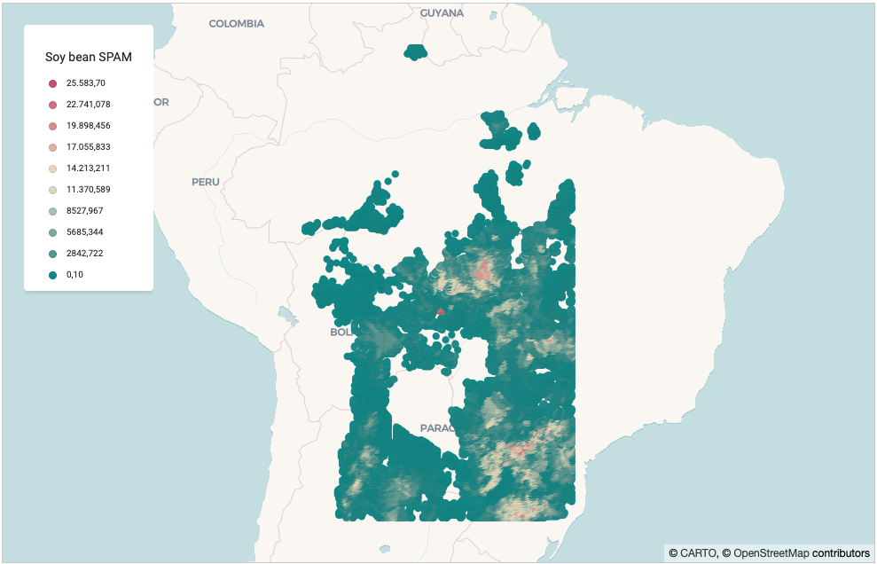
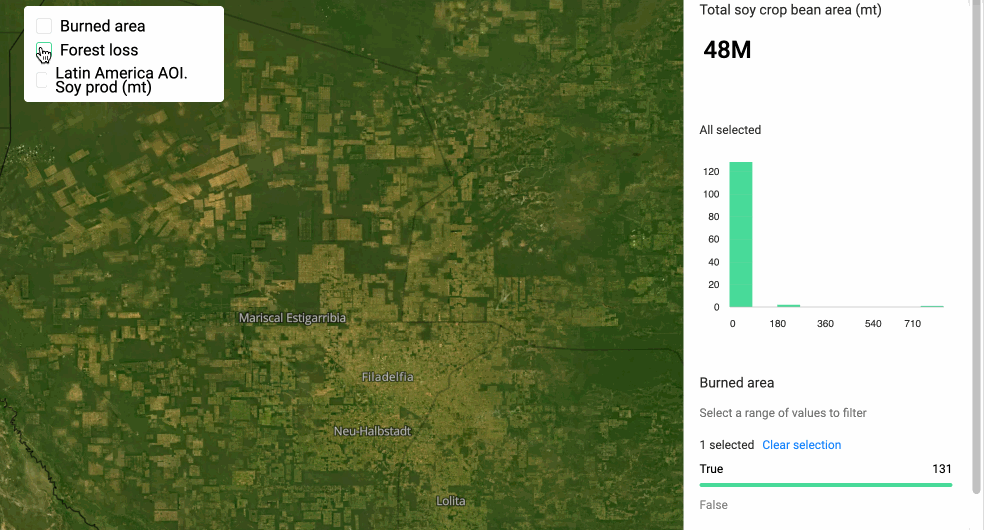
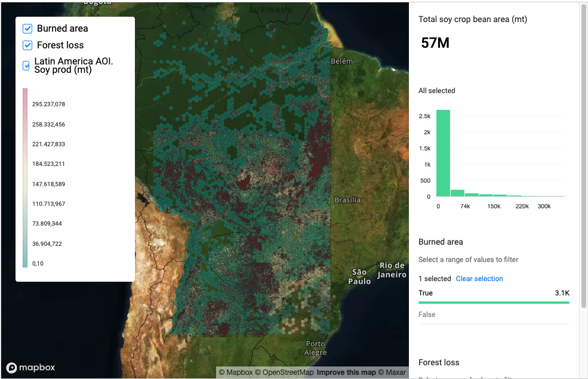

# Phase 2. Data analysis, visualization and conclusions

## Data analysis and visualization
### Python research package

In order to support different operations across the analysis, a Python package named `research` has been created.

The `research` package can be found [here](../research/). It is composed of the following main modules:

- `connections`: It's the core of the library, where the database client is defined. It permits interacting with the database in two main different ways: reading SQL queries and returning the result as a (Geo)DataFrame and performing operations within a SQL transaction.

- `analysis`: This module includes two submodules (_construct_ and _transform_) that currently allow creating different types of grids and enriching data sources through an intersect and aggregate approach.

- `viz`: Work in progress.

- `utils`: Includes utilities used by other components within the code.

### Data analysis and visualization

In order to analyze the SPAM data and contextualize it with other data sources (Burned area and Forest loss) within the two AOIs, an hexagon grid has been created and it has been enriched with the 3 different data sources via an intersection and aggregation process defined within the `research` package `analysis` module.

_Example hexagon grid for Asia_

The complete process followed can be found in this [Jupyter Notebook](../env/notebooks/Step%202.%20Exploratory%20Spatial%20Data%20Analysis.ipynb). A GIF with the walkthrough is also included below.

## Conclusions

After reviewing the data in detail, it seems that the situation reflected in both AOIs is considerably different and hence it will be presented apart.
### Asia AOI

Soy bean crops do not seem to be as relevant as in Latin America AOI, with the highest production being located at Madhya Pradesh state (north-west of India), followed by Maharashtra and Rajasthan.

#### Relation with burned areas and forest loss

It seems that there is no clear relation for the burned area for the selected period in the locations that reflect the highest soy bean productions.

Although there is indeed a crop area potentially affected by wildfires, the Forest loss data source does not show loss information for this area, and for this reason it could be that the burned area corresponded with non-forest.

### Latin America AOI

It seems that soy bean crops are quite relevant in Latin America, specially in Brazil in the states of Mato Grosso and Paraná, but also in Paraguay in the state of Rio Grande Do Sul.

The burned area and forest loss data sources reveal a huge impact on Latin America. In Paraguay we're able to see locations where forest loss shows the same pattern as new crops showed by satellite imagery:

_Example of forest area turned into crops in Paraguay_

Additionally, some of these areas show burned area information for the 2007-2010 period.

_Example of forest area affected by wildfires - currently transitioned into crops_

The same pattern is repeated geographically in several places, for instance it can also be detected in Mato Grosso area, where the highest soy production is.

_Additional example of forest area turned into crops in Mato Grosso state_

Finally, we're able to see high production soy bean crop areas that correspond with burned areas that present also present loss:

## Final thoughts and next steps

Probably I've missed a lot of context and there is much more information to extract from this analysis. Nonehteless, it's been definitely interesting to have had the chance to analyze this data, specially the relation from current crop areas with both forest loss and burned area information within the Latin America AOI.

Among different possible future steps, it might be interesting to research more on the situation in Latin America in this regard and also enrich the grid with additional information, including sociodemographics.

Finally, it'd be interesting to also research on the situation in this sense over time for the referred areas.